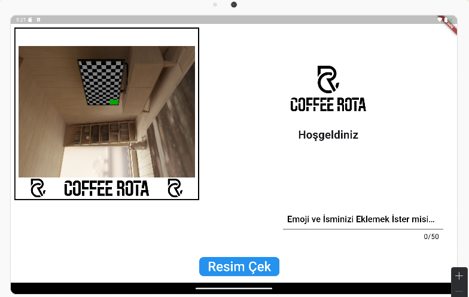
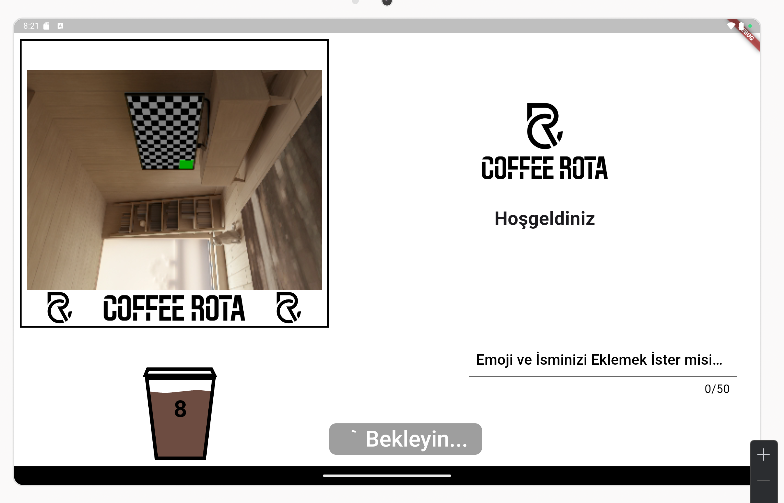

# 📸 Photo_Coffe

**Photo_Coffe** Flutter ile geliştirilmiş, kafelerde fotoğraf çekme ve bu fotoğrafın özel bir yazıcı ile basılarak **kahve bardağı üzerine transfer edilmesini** sağlayan bir mobil uygulamadır.  
Kullanıcıların unutulmaz anlarını kahve deneyimine dönüştürmeyi amaçlar.

---

## 📌 Proje Özeti

Photo_Coffe, aşağıdaki işlemleri kolayca yapabilen bir mobil uygulamadır:

- 📷 Kullanıcıdan fotoğraf alma
- 🖼️ Fotoğrafı uygulama içinde önizleme
- 🖨️ Yazıcıya gönderme
- ☕ Kahve bardağı üzerine baskı sürecini başlatma
- 💾 Basılan fotoğrafı kayıt etme
- 
---

## 🎯 Uygulama Özellikleri

### 📷 Fotoğraf Çekme & Seçme
- Kamera ile yeni fotoğraf çekme
- Fotoğraf önizleme

---

### 🛠️ Yazıcı Entegrasyonu
- Bluetooth / Wi‑Fi üzerinden yazıcı ile cihaz bağlantısı
- Fotoğrafı yazdırma komutu gönderme
- 
---

### 🖼️ Önizleme & Düzenleme
- Çekilen fotoğrafın ekranda gösterilmesi
- Önceki fotoğrafların listelenmesi

---

## 🧠 Kullanılan Teknolojiler

| Teknoloji           | Kullanım Amacı |
|--------------------|----------------|
| **Flutter**        | Cross‑platform mobil uygulama |
| **Dart**           | Uygulama programlama dili |
| **Plugins / Packages** | Kamera & Fotoğraf çekme, yazıcı bağlantısı |
| **Native Android**| Yazıcı SDK’ları için köprü |

---

